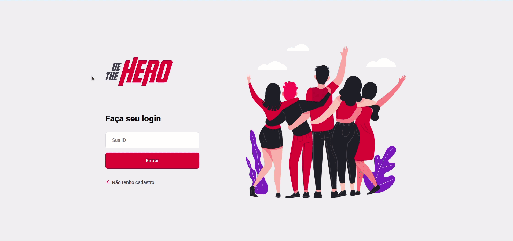
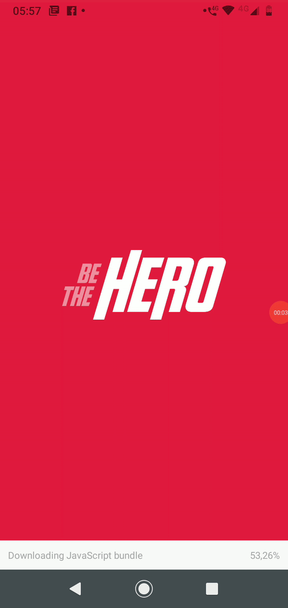

<h1 align="center">

</h1>

This is a **Web** and **Mobile** application using **JavaScript**, **NodeJS**, **ReactJS** and **ReactNative**.

# Application
## Web
On Web Application, ONGs can register itselves and register "cases" that need donations. These cases have title, description and price. ONGs can also delete previously registered cases, but not cases made by others ONGs.

## Mobile
The mobile application is made for anyone who wants to help and donate for an ONG. The main screen lists all available cases and their descriptions. The user can select a case and enter a page with more details of the chosen case. To donate, there are two options, contacting the ONG by email or by whatsapp clicking in one of the buttons avaiable on details page.

# Web Demonstration

<h1 align="center">
    
</h1>

# Mobile Demonstration

<h1 align="center">
    
</h1>

# Requirements
* **Node** - v10.19.0+
* **npm** - v6.14.4+
* **yarn** - v1.22.4+

# How to run

## Web
1. Clone this rep
2. Execute ```$ npm install``` on "/backend" and "/frontend" folders to install dependencies;
3. On backend folder, execute ```$ npm start```, then execute the same command on frontent folder;
4. The application is now running on <a href=http://localhost:3000> http://localhost:3000</a>.

## Mobile
1. First, execute <code>$ yarn install</code> on <code>'./mobile'</code> folder to install dependencies
2. Make sure that your phone and your computer are connected on the same internet
3. Then, execute <code>$ yarn start</code> on <code>'./mobile'</code> folder
4. A window will open automatically, and then copy the url link gived near the QRCode or scanning the QRCode
5. Go on ```'./mobile/src/services/api.js'``` file, and change this url:  
 <code>baseURL: 'http://192.168.15.8:3333'</code>  
 to your copied url changing the content after the ':' for 3333 (same as it where on previous code)
 6. Make sure the Web App is running
 7. Download 'Expo' app on PlayStore or AppStore
 8. Run <code>$ yarn start</code> again on <code>'./mobile'</code> folder and scan the QRCode with Expo app
 9. Enjoy the application :)